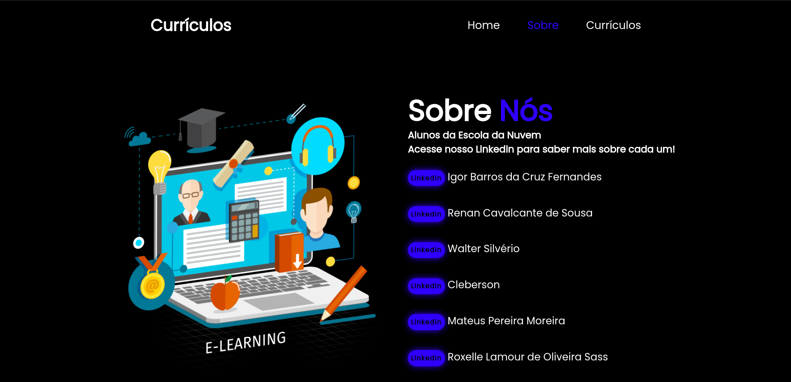
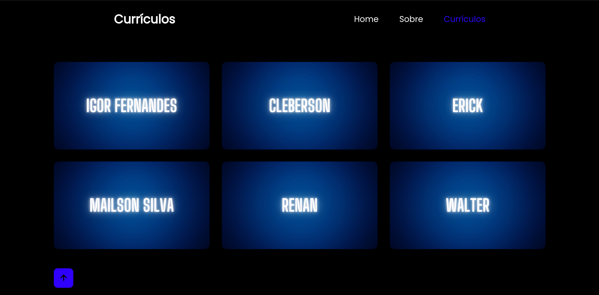

# Projeto de TCC da Escola da Nuvem

## Sobre o projeto
Neste repositório, você encontrará a criação de um portfólio contendo os currículos dos alunos da Escola da Nuvem - Grupo 5.

O objetivo do projeto foi criar um portfólio contendo os currículos dos alunos da Escola da Nuvem utilizando tecnologias simples como HTML5, CSS3 e JavaScript. O projeto foi realizado no curso "AWS Fundamentos" que é um curso da Escola da Nuvem, uma organização não governamental (ONG) que prepara estudantes para carreiras na nuvem e os conecta a potenciais empregadores.

## Tecnologias utilizadas


### Autores:
<table>
<tr>
<td align="center"><a href="https://github.com/igoorfernandes"><br /><sub><b>Igor Barros da Cruz Fernandes</b></sub></a><br/></td>
<td align="center"><a href="https://github.com/renanrcs"><br /><sub><b>Renan Cavalcante de Sousa</b></sub></a><br/></td>
<td align="center"><a href="https://github.com/Waltersilverio23"><br /><sub><b>Walter Silvério</b></sub></a><br/></td>
<td align="center"><a href="https://github.com/lilianmendesf"><br /><sub><b>Lilian Mendes Ferreira</b></sub></a><br/></td>
<td align="center"><a href="https://github.com/MattsxJ"><br /><sub><b>Mateus Pereira Moreira</b></sub></a><br/></td>
<td align="center"><a href="https://github.com/RoxelleSass"><br /><sub><b>Roxelle Lamour de Oliveira Sass </b></sub></a><br/></td>
</table>


### Como executar o projeto
Faça um clone deste repositório para o seu ambiente de desenvolvimento local.
```
git clone https://github.com/igoorfernandes/TCC-Escola_da_Nuvem.git
```
Abra o arquivo index.html no seu navegador web.
O portfólio será carregado e você poderá navegar pelos currículos dos alunos.


### Funcionalidades principais
Apresentação dos currículos dos alunos da Escola da Nuvem - Grupo 5.
Exibição de informações pessoais, habilidades, projetos e experiência educacional de cada aluno.
Navegação fácil entre os currículos dos alunos.
Contribuindo
Se você deseja contribuir para o projeto, siga as etapas abaixo:





O repositório está sob a licença MIT. Para mais detalhes, acesse <a href="https://github.com/igoorfernandes/TCC-Escola_da_Nuvem/blob/main/LICENSE">license</a>.
<br>

Feito por <a href="https://github.com/igoorfernandes">Igor Fernandes</a>
<br>
